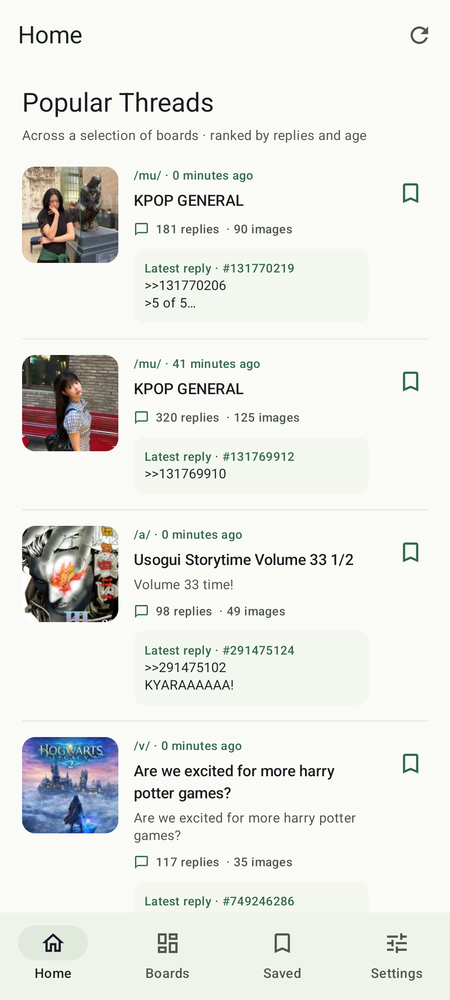

# Boardwalk for Android

A native reader for real 4chan boards, built with Kotlin and Jetpack Compose. Boardwalk is a working name and is not affiliated with 4chan.



Boardwalk is licensed under [GPL-3.0-only](LICENSE). Source and issue reports live in this repository. Builds from the `main` branch are development builds; the F-Droid listing is being submitted and is not live yet.

## Using the app

- Home starts with Popular Threads sampled and ranked by Boardwalk from public board catalogs, followed by a timeline from your favorite boards. This is not 4chan's unpublished homepage ranking. Star or unstar boards in Boards to choose what appears in your timeline. Home respects the work-safe/all-boards setting.
- Browse boards in the same named groups as the website, including Japanese Culture, Video Games, Interests, Creative, Other, Misc., and Adult. Pull down on Home, boards, or threads to refresh.
- Use the same sort filter on Home and each board: **Hot** weighs reply count against thread age, **New** uses creation time, and **Latest reply** uses the most recent reply time. Rows keep the opening post's title and image, with a tappable latest-reply preview when the API provides one. Refresh updates the feed; it does not poll in the background.
- Choose a board. Search and sort its compact thread list.
- Tap a thumbnail to open the full-screen viewer. Pinch or double-tap to zoom; swipe at normal zoom to move between that thread's images, or swipe down to dismiss the viewer. Arrow buttons are also available.
- Tap the thread text to read the discussion. Nested displays the opening post, reply connectors, parent context, and replies below their parent; unquoted replies belong directly under the opening post. Collapse a branch or choose Chronological for posting order. A post quoting several earlier posts nests once under the latest earlier one; every reference remains accessible. Tap a parent reference to preview it.
- Links to 4chan boards and threads open in Boardwalk with Back returning to the previous place. Cross-board quoted posts show an inline preview and can open the source thread; other web links use the browser.
- Android Back or the viewer's back button returns to the same browsing position.
- Star boards and bookmark threads to keep them nearby. Bookmarking also downloads an offline copy of the discussion. Saved shows download status and retry controls. Media is not bundled into that copy; use the viewer download button to save attachments separately.
- Choose a system, light, or dark theme in Settings. Work-safe boards appear by default; Settings can include all boards.

## Local backup and reinstall recovery

Fresh installs start with `/news/` (Current News) and `/biz/` (Business & Finance) starred. Existing explicitly saved favorites are preserved, including an empty set.

In Settings, choose a local backup folder. Android's picker is restricted to local providers. While the app is running, changes update timestamped JSON backup files; the two latest completed files are retained. New writes do not truncate the previous backup. Check the success message before uninstalling. Android can stop the app before an update completes, so the last completed backup is the restore point.

After reinstalling, use **Import backup** to select the newest JSON file and confirm replacement of the current app data. For another phone, transfer that file first. Includes favorites, bookmarks, offline discussion copies, reading positions, theme, reply layout, board visibility, and proxy address/port/mode. Proxy credentials, media attachments, caches, and backup folder permissions are excluded. Re-enter proxy credentials and select the backup folder again after restore. Media downloads are separate files and must be transferred separately if wanted.

No cloud backup, account, or background server is used. Android app-private data is removed on uninstall, so configure and verify an external local backup beforehand. Keep it outside Android/data (for example, a subfolder in Documents). Files are plain JSON; anyone with the file can read the saved discussions. Backups currently support up to 64 MB. Import validates the entire payload before changing data and journals the previous state to recover an interrupted restore.

## Proxy connection

Settings → Connection → Use a proxy. Supply an HTTP proxy hostname or IP address, port, and optional username/password. The proxy must support HTTPS CONNECT tunneling. Use **Test connection**, then **Save**.

The proxy covers in-app API requests, thumbnails, original images, GIFs, and videos. An explicitly configured proxy has no direct-connection fallback. Credentials are encrypted using Android Keystore and Android cloud/device-transfer backup is disabled. No proxy service or credentials are bundled. SOCKS and encrypted HTTPS-to-proxy transport are not implemented in this version.

The connection test checks the boards API using the entered settings. It does not certify the provider's privacy or test every media host. Links opened in an external browser use that browser's connection settings.

## Build

Requires JDK 17, Android SDK platform 35 and build-tools 35.0.0. Open this folder in Android Studio, or set `ANDROID_HOME` to an installed SDK and run:

```sh
./gradlew :app:assembleDebug :app:testDebugUnitTest
```

The debug APK is produced at `app/build/outputs/apk/debug/app-debug.apk`. This is a sideloadable development build, not a signed store release. For device UI tests, start an emulator or attach an Android device and run:

```sh
./gradlew :app:connectedDebugAndroidTest
```

The local workspace's `local.properties` is machine-specific and excluded from the source archive. Android Studio creates its own when opening the project.

## Implementation

- `data/ReplyTree.kt`: board-scoped quote references, cycle-safe nesting under the opening post, and branch collapse.
- `data/ReaderLinks.kt`: canonical 4chan link parsing for native board and thread navigation.
- `data/Backup.kt`: versioned local backup format and validation.
- `data/HomeFeed.kt` and `data/PopularFeed.kt`: favorite-board selection, cross-board ordering, sampled popular ranking, progressive refresh, partial-failure retention, and board-scoped identity.
- `data/BoardCategories.kt`: website-style board groups, applied to the live board list.
- `ui/HomeScreen.kt`: Popular Threads and mixed favorite-board timeline with compact media and discussion actions.
- `data/Network.kt`: shared HTTP client factory, explicit proxy routing, request cancellation, conditional GET, response caching, serialized API request budget, and throttling backoff.
- `data/LocalStore.kt`: favorites, bookmarks, reading positions, themes, and encrypted proxy credentials.
- `ReaderModel.kt`: browsing and gallery state; independent catalog/reader and media loading.
- `ui/MediaViewer.kt`: full-screen images, zoom/pan, pager, and Media3 playback through the same HTTP client.
- `ui/BoardwalkApp.kt`: native navigation, board/catalog/reader flows, quote previews, and saved threads.

No accounts, analytics, posting API, proxy server, or hosted backend are included. Posting is a handoff to the original website. The source API is read-only and limits request frequency; rapid refresh may reuse content briefly.

## Contributing and releases

See [CONTRIBUTING.md](CONTRIBUTING.md) for local checks. F-Droid build metadata and store text are in [`.fdroid.yml`](.fdroid.yml) and [`fastlane/metadata/android/en-US/`](fastlane/metadata/android/en-US/). Release and store submission steps are in [`docs/RELEASING.md`](docs/RELEASING.md). A debug APK is for testing and is not an upgrade-compatible store release.

References: [4chan API and usage rules](https://github.com/4chan/4chan-API), [Android Compose](https://developer.android.com/compose), [Media3 OkHttp data source](https://developer.android.com/reference/androidx/media3/datasource/okhttp/OkHttpDataSource.Factory).
